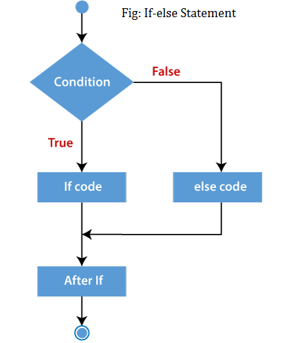
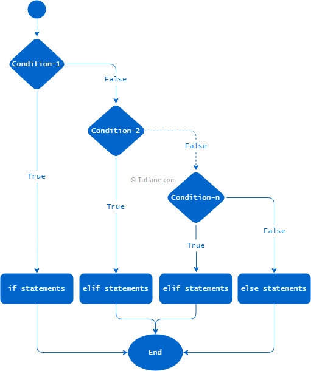

# Introduction

## What is Python?

- Created in 1991 (and named after Monty Python show)
- General-purpose programming language
- Interpreted (scripting) language

## Why everybody is using it?

- Designed to be easy to learn -> it was/is used a lot for teaching
- Readable code
- Open-source and free
- Easy to interact with
- Early adopters were Google, YouTube, NASA…
- Big community -> many libraries available for many different topics


## Packages (libraries)

- Collections of functionalities
- Cover a certain topic / domain
- Everybody can share a library
  - Many domains covered
  - Not verified and not always correct
- ~ 300,000 packages

[The Python Package Index (PyPI) repository](https://pypi.org/)


## How does Python understand data?


[Reference](https://www.tutorialandexample.com/python-data-structures/)

## Collections

- **Lists** -- mutable, ordered
  - my_list = [1, ‘test’, 5.8]
- **Tuples** -- immutable, ordered
  - my_tuple = (1, ‘test’, 5.8)
- **Dictionaries** -- key-value pairs, no order
  - my_dict = {‘petra’ : ’petra@adaltas.com’}
- **Sets** -- mutable, unordered, no repeats
  - my_set = {1, 3, 6, 9}

[Click here](https://github.com/sowmya20/DataStructures_Intro) to explore more functionalities of Python collections.

## How can we manipulate data?

Through **functions**:

- Code that solves a specific task
- Types:
  - *Built-in*: `type()`, `print()``
  - *Imported* from libraries: `from <module> import <function>`
  - *Custom*: `def my_funct()`

To be able to write meaningful functions, we need to get to know some other **constructs** first:

- Conditional statements
- Loops
- Boolean expressions

## Conditional statement

Evaluates a condition and depending on the result, it **executes different branch** of code:

```python
a = 200
b = 33

if b > a:
  print("b is greater than a")
else:
  print("b is not greater than a")
```

If you want multiple conditions, you can chain them with `elif`.

- If … else



- If … elif … else



## Loops

To **repeat** the same action multiple times, you use loops:

- **For loop**: repeats the same action n-times

```python
for i in range(1, 10):
  print(i)
```

- **While loop**: repeats as long as condition is true

```python
i = 0

while i < 10:
  print(i)
  i = i + 1
```

## Boolean expressions

Expressions that **compares data** and returns a Boolean value as a result (True, False):

- Comparisons (>, <, =)
- Inclusions (is in)
- Chaining conditions with Boolean operators: AND, OR, NOT

## User-defined functions

When a function we need doesn't exist, we need to writ it ourselves. In Python:

- It always starts with **def**
- It can take none, one or more **arguments**
- It **always returns** a value
  - explicit return: a function contains return statement
  - implicit return: a function doesn't contains return statement. In this case, the function returns `None`.

```python
# This function returns name
def return_name(name):
  return(name)
```

```python
# This function prints name and returns None
def print_name(name):
  print(name)
```

[Reference](https://realpython.com/python-return-statement/)

## More material and exercises on:

- [w3schools](https://www.w3schools.com/python/default.asp)
- [RealPython](https://realpython.com)
- [Exercises with solutions](https://www.w3resource.com/python-exercises/)
